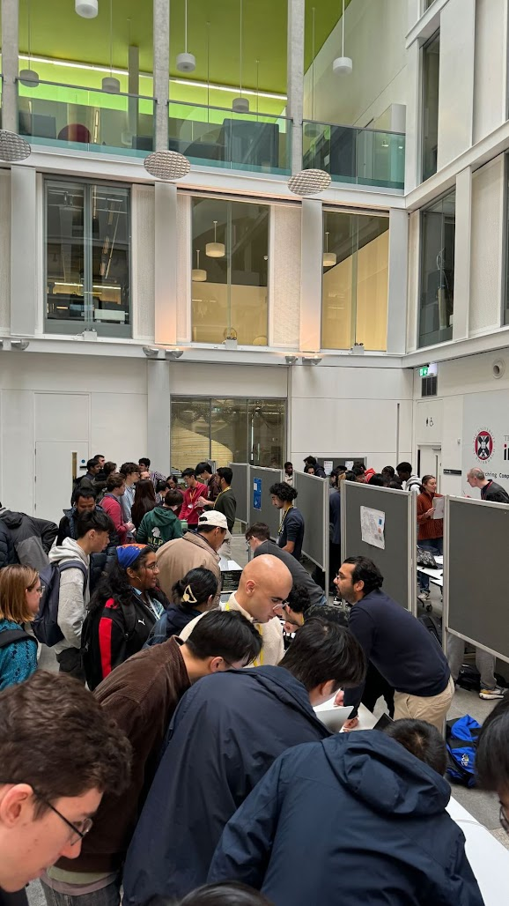

---
~
---
> [!danger] Our Mission
> EdinburghAI is The [[University of Edinburgh]]'s [[AI]] society. Our mission is: 
> 
> ***Empower students and the broader community, transforming them into the next generation of AI builders and researchers***. 

![[20d1e698-5a5b-4eb1-ac49-941b8af1d501.jpg]]
*@Ben Alison from Amazon Advertising giving a talk*
## What Do We Do? 
- ***Host Talks:*** We've had [[Google DeepMind]], Amazon and Spotify (and more!) give talks. With [[AI|AI-based]] talks from robotics to recommendation systems, I've learned something new every talk.

- ***Workshops:*** These were split into 2 parts:
	- ***Beginner-Friendly:*** Taught the fundamentals of [[AI|Machine Learning]] in a beginner-friendly way. Check them out [here](https://github.com/EdinburghAI/workshops)!
	- ***Advanced:*** For those with a better grasp of concepts, we held reading and discussion groups, reading the latest papers and tools like [DSPy](https://github.com/stanfordnlp/dspy)!

- ***EdinburghAI Expo:*** Our flagship event is a *science-fair-like* event. It works like so:
	- Students apply at the start of the school year. 
	- They choose a project (given a [rubric](https://drive.google.com/file/d/1-Og-5sb80sQZB22dMDoYmqZHs5oVK3MA/view)) and start to build a project they think would do well!
	- On the day of the event, academia, industry, students and researchers alike come together and view the projects on display. 
	- The projects will be judged on the day and the top teams will win some sweet prizes (first place 2024 was £1000 🤑).

  

	
	
<em>A photo of our inaugural AI Expo!</em>

  

  

    <h3>How did the society begin?</h3>
	

	    In 2nd year, I was ranting to my friend from 
	    <a href="https://www.eusa.ed.ac.uk/activities/view/mathsoc" target="_blank">MathSoc</a> 
	    that I was struggling to find people equally interested in ML. He said it was funny; 
	    <em>I was the 2nd person to say that to him that week</em>. The first was 
	    <a href="https://www.linkedin.com/in/pascual-merita-torres/" target="_blank">Pascual Merita Torres</a>.
	

	

	    After a coffee chat, the rallying of some of our mates and some society-founding-bureaucracy, 
	    we founded EdinburghAI. I could not have asked for a better co-founder of the society. 
	

	

		I've learned a lot at EdinburghAI. I learned that <strong><em>I get so vividly energised when working with a team of cracked people</em></strong>. Any endeavour I take in the future, that'll be a central part to it. 
	

	<h3>Company, academic or student interested in getting involved?</h3>
	
As of writing, I'm still at Uni and the president. If you're reading this and want to contribute in some way, reach <a href="https://x.com/LeoCamacho43" target="_blank">out!</a>

  

